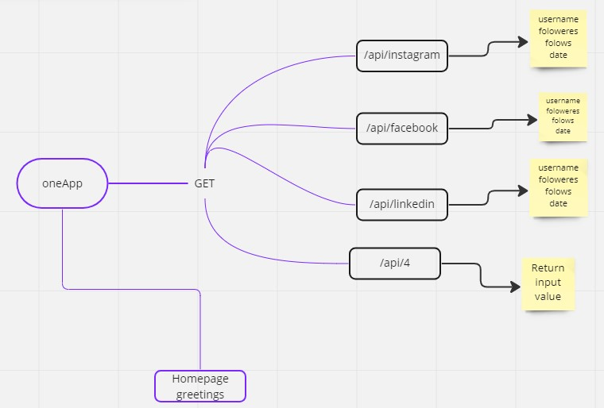

# Mini Social App API

#### Goals
    1. The first goal of this project was to create basic API where requests can be made and responses
        sent back to the user in json format.

    2. The second goal was to write proper documentation af all API created using Swagger-UI for proper
        software documentatuion

#### Tools
    1. JavaScript (Scripting language)
    2. Nodejs (JavaScript runtime)
    3. Express.js (Server framework)
    4. Swagger-UI (for documentation).

#### Mind Map (Design)

